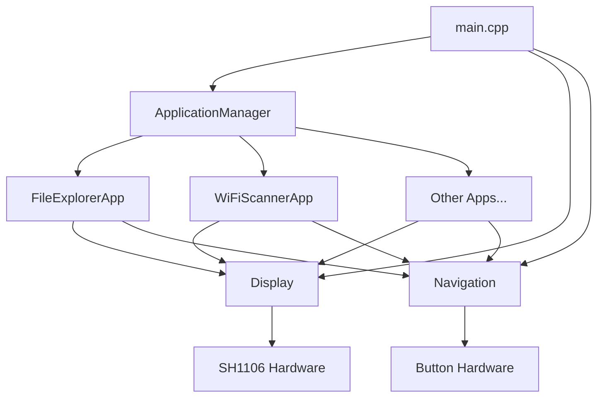

# Data Flow Between Components

## System Architecture Overview

The firmware follows a modular architecture with a clear separation of concerns. The main components interact through well-defined interfaces, ensuring loose coupling and easy extensibility.

## Component Interaction Diagram



## Detailed Data Flow

### 1. System Initialization Flow
1. `main()` function initializes all subsystems
2. Display subsystem is initialized
3. Button/input subsystem is initialized
4. Application manager is initialized
5. All registered applications are initialized through their `initialize()` method

### 2. Main Loop Data Flow
1. **Input Processing Phase**:
   - Navigation system reads current button states
   - Button debouncing is applied
   - Events are generated for button presses/releases

2. **Application Update Phase**:
   - Application manager forwards navigation events to the current application
   - Current application processes events through corresponding handler methods
   - Application updates its internal state

3. **Rendering Phase**:
   - Current application's `render()` method is called
   - Application draws its UI to the display buffer
   - Display buffer is flushed to the SH1106 hardware

### 3. Application Switching Flow
1. Navigation system detects application switch command (e.g., long press of back button)
2. Application manager stops current application (calls `cleanup()`)
3. Application manager switches to new application
4. New application is started (calls `initialize()`)
5. Display is cleared for new application

### 4. Inter-Application Communication
Applications communicate with each other through the ApplicationManager:
1. Applications can request to switch to another application
2. Applications can share data through a shared data manager (future extension)
3. Applications can register for system events

## Data Structures

### Navigation Events
```cpp
struct NavigationEvent {
    enum Type {
        UP_PRESSED,
        DOWN_PRESSED,
        LEFT_PRESSED,
        RIGHT_PRESSED,
        OK_PRESSED,
        BACK_PRESSED,
        UP_RELEASED,
        DOWN_RELEASED,
        // ... other events
    } type;
    unsigned long timestamp;
};
```

### Display Buffer
The display buffer is managed internally by the Display class:
- 128x64 pixel buffer for SH1106
- 1-bit per pixel format
- Double buffering to prevent flickering

### Application State
Each application maintains its own state:
- Running/paused status
- UI state (selected items, scroll positions, etc.)
- Data being processed or displayed