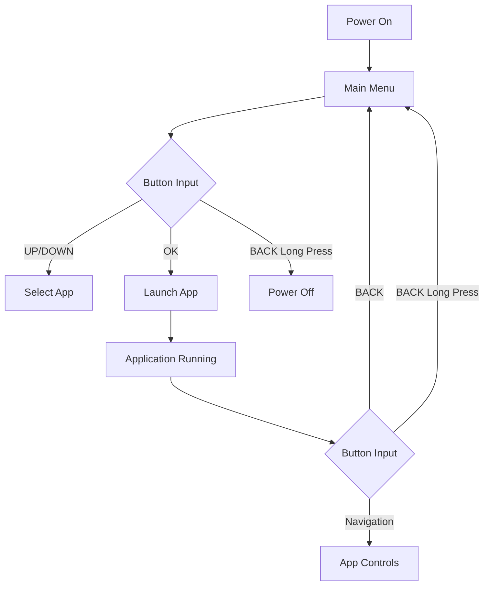

# Button Mapping and Navigation System

## Hardware Button Layout

The device features a 5-way navigation button and 2 additional function buttons, similar to the Flipper Zero:

```
    [UP]
[LEFT] [OK] [RIGHT]
   [DOWN]
   
[BACK]    [FUNCTION]
```

## Pin Configuration

### Default Button Pin Assignments
```cpp
// config.h
#define BUTTON_UP_PIN      14
#define BUTTON_DOWN_PIN    12
#define BUTTON_LEFT_PIN    13
#define BUTTON_RIGHT_PIN   15
#define BUTTON_OK_PIN      16
#define BUTTON_BACK_PIN    17
#define BUTTON_FUNCTION_PIN 18
```

## Button States and Events

### Basic Button States
1. **Pressed**: Button is currently held down
2. **Released**: Button is currently not pressed
3. **Was Pressed**: Button transitioned from released to pressed
4. **Was Released**: Button transitioned from pressed to released

### Advanced Button Events
1. **Click**: Brief press and release (less than 500ms)
2. **Long Press**: Extended press (more than 1000ms)
3. **Double Click**: Two quick clicks in succession
4. **Hold**: Continuous press with periodic repeat events

## Navigation System Implementation

### Button Class with Advanced Features
```cpp
class Button {
private:
    int pin;
    bool lastState;
    bool currentState;
    unsigned long lastDebounceTime;
    unsigned long lastPressTime;
    unsigned long debounceDelay;
    bool pressedOnce;
    unsigned long lastClickTime;
    
public:
    Button(int buttonPin);
    void update();
    bool isPressed();
    bool wasPressed();
    bool wasReleased();
    bool isLongPressed(unsigned long duration = 1000);
    bool wasClicked();
    bool wasDoubleClicked();
    bool isHeld();
};
```

### Navigation Manager
```cpp
class Navigation {
private:
    Button upButton;
    Button downButton;
    Button leftButton;
    Button rightButton;
    Button okButton;
    Button backButton;
    Button functionButton;
    
    // Navigation context
    bool inMainMenu;
    bool inApplication;
    
public:
    Navigation();
    void update();
    
    // Basic button state queries
    bool isUpPressed();
    bool isDownPressed();
    bool isLeftPressed();
    bool isRightPressed();
    bool isOkPressed();
    bool isBackPressed();
    bool isFunctionPressed();
    
    // Event-based queries
    bool wasUpClicked();
    bool wasDownClicked();
    bool wasOkClicked();
    bool wasBackClicked();
    bool wasFunctionClicked();
    
    // Long press detection
    bool isUpLongPressed();
    bool isDownLongPressed();
    bool isOkLongPressed();
    bool isBackLongPressed();
    bool isFunctionLongPressed();
    
    // Context setters
    void setContextMainMenu();
    void setContextApplication();
};
```

## Global Navigation Controls

### System-Level Navigation
1. **Back Button Long Press**: Return to main menu from any application
2. **Function Button**: Context-sensitive function (application dependent)
3. **OK + Back Combination**: System reset or special function

### Application-Level Navigation
1. **Up/Down**: Navigate through lists or options
2. **Left/Right**: Adjust values or switch between panels
3. **OK**: Confirm selection or activate function
4. **Back**: Cancel, go back, or exit

## Menu Navigation System

### Main Menu Navigation
- **Up/Down**: Move between applications in the main menu
- **OK**: Launch selected application
- **Back**: Power off or sleep mode (when on main menu)

### In-Application Navigation
- **Up/Down**: Application-specific navigation
- **Left/Right**: Application-specific navigation
- **OK**: Confirm or activate
- **Back**: Return to main menu
- **Function**: Application-specific function

## Navigation Flow Diagram



## Button Handling in Applications

### Application Interface Extensions
```cpp
class Application {
public:
    // Basic navigation
    virtual void onUpButton();
    virtual void onDownButton();
    virtual void onLeftButton();
    virtual void onRightButton();
    virtual void onOkButton();
    virtual void onBackButton();
    
    // Advanced navigation
    virtual void onUpButtonLong();
    virtual void onDownButtonLong();
    virtual void onOkButtonLong();
    virtual void onBackButtonLong();
    virtual void onFunctionButton();
    virtual void onFunctionButtonLong();
    
    // Gestures
    virtual void onUpDoubleClick();
    virtual void onDownDoubleClick();
};
```

## Context-Sensitive Navigation

### Main Menu Context
- Up/Down: Navigate applications
- OK: Launch application
- Back (long): Power off

### File Explorer Context
- Up/Down: Navigate files/directories
- OK: Open file or enter directory
- Left/Right: (if applicable) switch views
- Back: Go to parent directory or exit

### WiFi Scanner Context
- Up/Down: Navigate WiFi networks
- OK: Connect to selected network or view details
- Back: Exit scanner

## Debouncing and Timing

### Debouncing Algorithm
```cpp
void Button::update() {
    bool reading = digitalRead(pin);
    
    if (reading != lastState) {
        lastDebounceTime = millis();
    }
    
    if ((millis() - lastDebounceTime) > debounceDelay) {
        if (reading != currentState) {
            currentState = reading;
            if (currentState) {
                lastPressTime = millis();
                pressedOnce = true;
            }
        }
    }
    
    lastState = reading;
}
```

### Timing Constants
```cpp
// config.h
#define BUTTON_DEBOUNCE_DELAY 50
#define CLICK_THRESHOLD 500
#define LONG_PRESS_THRESHOLD 1000
#define DOUBLE_CLICK_THRESHOLD 300
#define HOLD_REPEAT_DELAY 500
#define HOLD_REPEAT_INTERVAL 200
```

## Special Navigation Gestures

### Multi-Button Combinations
1. **OK + Up**: Fast scroll up
2. **OK + Down**: Fast scroll down
3. **Left + Right**: Refresh or reset view
4. **All Directional Buttons**: System diagnostic mode

### Button Sequence Detection
1. **Up, Up, Down, Down**: Special function (e.g., debug mode)
2. **Left, Right, Left, Right**: Special function (e.g., settings)

## Implementation Example

### Main Loop Navigation Handling
```cpp
void handleNavigation() {
    navigation.update();
    
    if (inMainMenu) {
        if (navigation.wasUpClicked()) {
            // Move selection up in main menu
            mainMenu.selectPrevious();
        }
        else if (navigation.wasDownClicked()) {
            // Move selection down in main menu
            mainMenu.selectNext();
        }
        else if (navigation.wasOkClicked()) {
            // Launch selected application
            appManager.switchToApplication(mainMenu.getSelectedIndex());
        }
        else if (navigation.isBackLongPressed()) {
            // Power off device
            powerOff();
        }
    }
    else {
        // In application context
        Application* currentApp = appManager.getCurrentApplication();
        if (currentApp) {
            // Forward navigation events to current application
            if (navigation.wasUpClicked()) {
                currentApp->onUpButton();
            }
            else if (navigation.wasDownClicked()) {
                currentApp->onDownButton();
            }
            // ... other button events
        }
    }
}