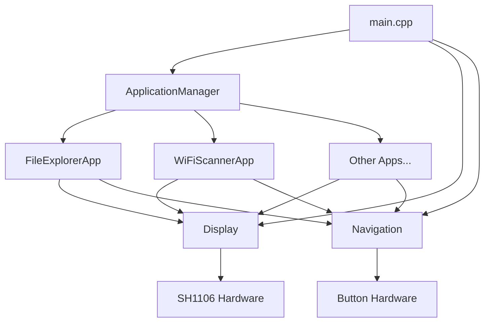
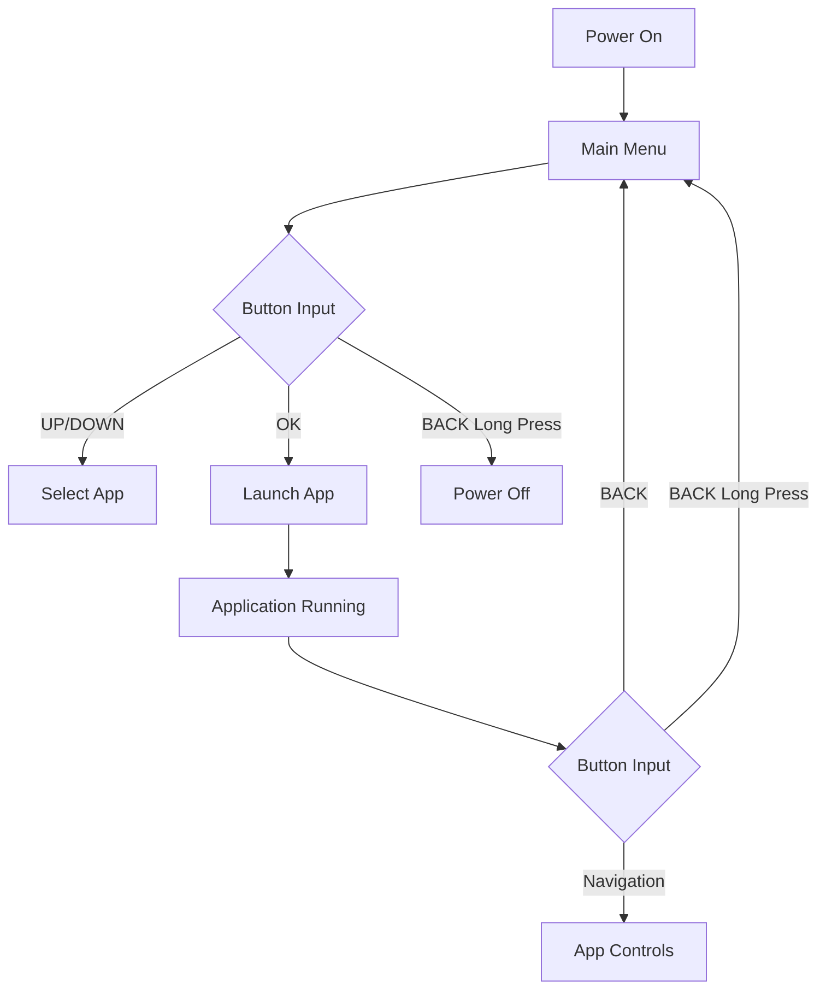

# Modular Firmware Architecture for ESP32 with SH1106 Display

## Overview

This document describes a modular firmware architecture for an ESP32-based device with a SH1106 OLED display, similar to the Flipper Zero. The architecture is designed to be extensible, allowing new applications to be added with minimal changes to existing code.

## System Requirements

- ESP32 microcontroller
- SH1106 128x64 OLED display
- 5-way navigation button + 2 function buttons
- Arduino framework (PlatformIO)
- Modular, extensible design

## File Structure and Organization

```
src/
├── main.cpp                 # System initialization and main loop
├── config.h                 # System configuration and pin definitions
├── graphics/
│   ├── display.cpp          # Display driver and basic drawing functions
│   ├── display.h            # Display class declarations
│   ├── bitmaps.cpp          # Bitmap and graphic assets
│   └── bitmaps.h            # Bitmap declarations
├── core/
│   ├── button.cpp           # Button handling and debouncing
│   ├── button.h             # Button class declarations
│   ├── navigation.cpp       # Navigation system and menu handling
│   └── navigation.h         # Navigation class declarations
├── apps/
│   ├── app_interface.h      # Base application interface
│   ├── app_manager.cpp      # Application manager
│   ├── app_manager.h        # Application manager declarations
│   ├── file_explorer/
│   │   ├── file_explorer.cpp # File explorer application implementation
│   │   └── file_explorer.h   # File explorer class declarations
│   └── wifi_scanner/
│       ├── wifi_scanner.cpp  # WiFi scanner application implementation
│       └── wifi_scanner.h    # WiFi scanner class declarations
└── utils/
    ├── logger.cpp           # Logging utilities
    └── logger.h             # Logging utilities declarations
```

## Class and Interface Designs

### Core System Classes

#### Display Class
Handles communication with the SH1106 OLED display and provides drawing primitives.
 Also provides access to the display buffer for remote visualization through the getDisplayBuffer method.

#### Button Class
Implements button handling with debouncing, long press detection, and multi-click detection.

#### Navigation Class
 Also accepts external events for remote control functionality through the serial interface.
Manages all input buttons and provides a clean interface for navigation events.

### Application Framework

#### Application Interface
Defines the base interface that all applications must implement:
- Lifecycle methods (initialize, update, render, cleanup)
- Navigation handlers (onUpButton, onDownButton, etc.)
- Metadata methods (getName, isRunning)

#### Application Manager
Manages application registration, switching, and lifecycle.

## Data Flow Between Components

### System Architecture Overview



### Main Loop Data Flow
1. Input Processing Phase
2. Application Update Phase
3. Rendering Phase

## Application Integration Mechanism

### Registration Process
1. Create a class that inherits from the Application interface
2. Implement all required methods
3. Register the application with the ApplicationManager

### Example Implementation
```cpp
class MyApp : public Application {
    // Implementation
};

// Registration in main.cpp
appManager.registerApplication(new MyApp());
```

## Button Mapping and Navigation System

### Hardware Button Layout
```
    [UP]
[LEFT] [OK] [RIGHT]
   [DOWN]
   
[BACK]    [FUNCTION]
```

### Navigation Flow


## Initial Applications

### File Explorer
- Browse file system
- Navigate directories
- View file information

### WiFi Scanner
- Scan for WiFi networks
- Display network information
- Connect to networks (future enhancement)

## Extensibility

### Adding New Applications
1. Create a new directory in `src/apps/`
2. Implement the Application interface
3. Register with ApplicationManager

### Future Enhancements
- Dynamic application loading
- Shared data manager
- Event system for inter-application communication

## Memory Management

- Applications are instantiated once and reused
- Display uses double buffering to prevent flickering
- Button debouncing prevents false triggers
- Efficient use of ESP32 resources

## Power Management

- Sleep mode when idle
- Display dimming after inactivity
- Low power modes for battery operation

## Error Handling

- Graceful degradation when applications fail

## Remote Control Display Feature

The remote control display feature allows external applications to visualize what is currently displayed on the device's screen. This is accomplished through:

- A getDisplayBuffer method in the Display class that provides access to the current display buffer
- A NAV_GET_DISPLAY event in the Navigation system that triggers the transmission of display data over serial
- A serial command parser that recognizes the "GET_DISPLAY" command
- A Python GUI controller that requests and displays the device screen in real-time

The display data is transmitted as 1024 bytes (128x64 pixels) of binary data, with each bit representing the state of one pixel on the OLED display.
- Logging system for debugging
- Recovery mechanisms for system errors